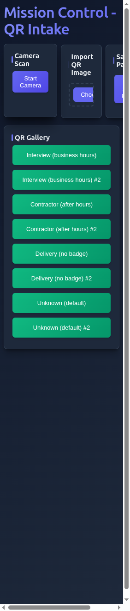
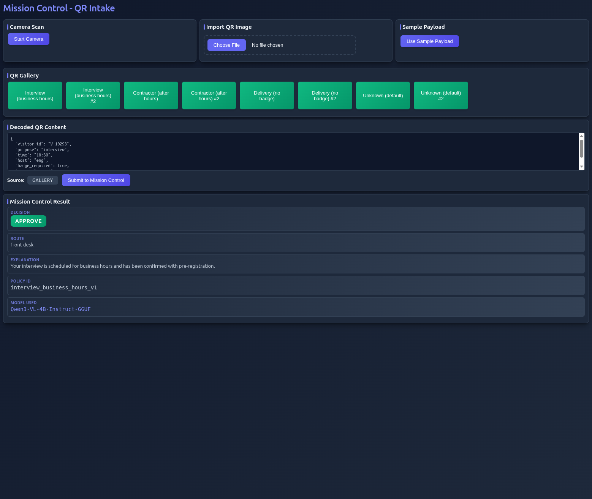
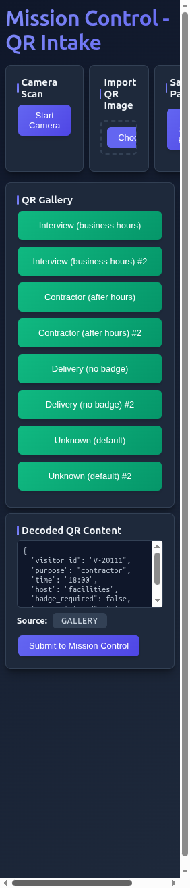
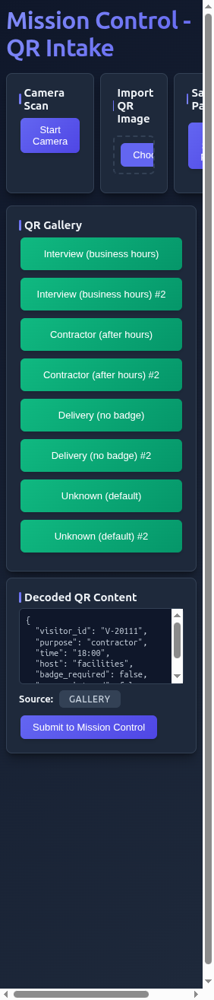

# Mission Control - QR Intake with Lemonade

A Lemonade developer contest demo that demonstrates:
1. **Lemonade model lifecycle** (download + load + serving)
2. **Mission Control routing** - A lightweight policy-based request router
3. **QR code intake** - Web app for scanning QR codes and routing visitor requests

## Quick Start

```bash
# 1. Install dependencies (from project root)
npm install && cd server && npm install && cd .. && cd ui && npm install && cd ..

# 2. Generate QR test images
npm run gen:qrs

# 3. Start Lemonade (Terminal 1)
lemonade pull Qwen3-VL-4B-Instruct-GGUF
lemonade load Qwen3-VL-4B-Instruct-GGUF
lemonade serve

# 4. Start backend (Terminal 2, from project root)
npm run dev:server

# 5. Start frontend (Terminal 3, from project root)
npm run dev:ui

# 6. Open http://localhost:3000 in browser
```

**See [Installation](#installation) and [Running the Application](#running-the-application) for detailed instructions.**

## Demo Video

[](https://www.youtube.com/watch?v=YLiru2x2r3g)

*Click the thumbnail above to watch the demo video on YouTube*

## Screenshots

### Main Interface

*The main application interface features a modern dark theme with three input methods in the top row: Camera Scan (left), Import QR Image (center), and Sample Payload (right). Below is the QR Gallery with 8 pre-generated test scenarios. The compact layout is designed to fit on a laptop screen without excessive scrolling.*

### QR Decoding - Interview Scenario

*After clicking "Interview (business hours)" from the QR Gallery, the decoded JSON payload is displayed in the "Decoded QR Content" section. The payload shows visitor information including visitor_id, purpose, time, host, and badge requirements. The source is indicated as "GALLERY" and the "Submit to Mission Control" button is ready for submission.*

### Mission Control Result - Interview Approved

*Complete workflow result for an interview scenario during business hours. The Mission Control system evaluated the payload and returned: **Decision**: APPROVE (green badge), **Route**: front_desk, **Explanation**: Enhanced by Lemonade VLM explaining the approval reason, **Policy ID**: interview_business_hours_v1, and **Model Used**: Qwen3-VL-4B-Instruct-GGUF. This demonstrates the full pipeline from QR decoding to policy evaluation to VLM-enhanced explanation.*

### QR Decoding - Contractor Scenario

*Contractor scenario QR code decoded from the gallery. The payload shows a contractor visit scheduled for 18:00 (after business hours) with visitor_id V-20111. The decoded content is displayed in formatted JSON, ready for submission to Mission Control. This scenario will trigger the contractor_after_hours_v1 policy.*

### Mission Control Result - Contractor Review

*Result for the contractor after-hours scenario. The system routed this to **security** with a **review** decision, as contractors visiting outside business hours require additional verification. The explanation is enhanced by the Lemonade VLM to provide clear, user-friendly reasoning. This demonstrates how different policies produce different routing decisions based on the payload content.*

---

**Note**: All screenshots show the application running with the Lemonade VLM service active. The explanations in the Mission Control results are enhanced by the VLM, which is a required component of the workflow.

## What This Demo Shows

This application demonstrates:

- **Lemonade Integration**: Explicit model download, load, and serving workflow
- **Policy-Based Routing**: Deterministic evaluation of visitor intake requests using 4 hardcoded policies
- **QR Code Processing**: Multiple input methods (camera, file import, gallery) for QR code scanning
- **LLM Enhancement**: Required explanation enhancement using Lemonade VLM (no fallback)

### Architecture

- **Backend**: Node.js + TypeScript + Express
  - Policy evaluation engine
  - Lemonade API client
  - Intake endpoint (`POST /intake`)

- **Frontend**: Vite + React + TypeScript
  - Camera-based QR scanning
  - QR image import
  - Pre-generated QR gallery
  - Result visualization

## Lemonade Setup

**IMPORTANT**: 
- This demo assumes Lemonade is already installed locally
- The backend does NOT manage Lemonade lifecycle
- **VLM is REQUIRED** - The workflow will fail if Lemonade is unavailable (no fallback)

### Step 1: Pull the Model

```bash
lemonade pull Qwen3-VL-4B-Instruct-GGUF
```

Or use another Lemonade-supported model of your choice.

### Step 2: Load the Model

```bash
lemonade load Qwen3-VL-4B-Instruct-GGUF
```

### Step 3: Start Lemonade Server

```bash
lemonade serve
```

By default, Lemonade serves on `http://localhost:8000`. The backend will call:
- Endpoint: `http://localhost:8000/v1/chat/completions`
- Model: `Qwen3-VL-4B-Instruct-GGUF` (or the model you specified

### Step 4: Configure Backend (Optional)

Set environment variables if your Lemonade instance differs:

```bash
export LEMONADE_BASE_URL=http://localhost:8000
export LEMONADE_MODEL_NAME=Qwen3-VL-4B-Instruct-GGUF
```

## Prerequisites

Before running the application, ensure you have:

- **Node.js 18+** and **npm** installed
- **Lemonade** installed locally (see [Lemonade Setup](#lemonade-setup) above)
- **Lemonade model** downloaded and loaded (see [Lemonade Setup](#lemonade-setup) above)

## Installation

**IMPORTANT**: All commands below should be run from the **project root directory** (`mission-control-lite-qr-intake-lemonade/`), not from `server/` or `ui/` subdirectories.

### Step 1: Install Dependencies

From the project root:

```bash
# Install root dependencies (for QR generation tool)
npm install

# Install server dependencies
cd server && npm install && cd ..

# Install UI dependencies
cd ui && npm install && cd ..
```

### Step 2: Generate QR Test Images

Generate the test QR code images:

```bash
npm run gen:qrs
```

This creates 8 QR code images in `ui/public/qrs/` for testing different policy scenarios.

### Step 3: Configure Environment Variables (Optional)

If your Lemonade instance uses different settings, create a `.env` file in the `server/` directory:

```bash
# server/.env
LEMONADE_BASE_URL=http://localhost:8000
LEMONADE_MODEL_NAME=Qwen3-VL-4B-Instruct-GGUF
```

Or export them in your shell:

```bash
export LEMONADE_BASE_URL=http://localhost:8000
export LEMONADE_MODEL_NAME=Qwen3-VL-4B-Instruct-GGUF
```

**Default values** (if not set):
- `LEMONADE_BASE_URL`: `http://localhost:8000`
- `LEMONADE_MODEL_NAME`: `Qwen3-VL-4B-Instruct-GGUF`

## Running the Application

### Quick Start (3 Terminals)

You'll need **3 terminal windows** running simultaneously:

#### Terminal 1: Start Lemonade (REQUIRED FIRST)

```bash
# Ensure Lemonade model is loaded
lemonade load Qwen3-VL-4B-Instruct-GGUF

# Start Lemonade server
lemonade serve
```

**Important**: Lemonade must be running before starting the backend, as the VLM is required for the workflow.

#### Terminal 2: Start Backend Server

From the project root:

```bash
npm run dev:server
```

Or manually:
```bash
cd server && npm run dev
```

The server will start on `http://localhost:8080`. You should see:
```
Server running on http://localhost:8080
Lemonade configured: http://localhost:8000
Model: Qwen3-VL-4B-Instruct-GGUF
```

#### Terminal 3: Start Frontend UI

From the project root:

```bash
npm run dev:ui
```

Or manually:
```bash
cd ui && npm run dev
```

The UI will start on `http://localhost:3000`. Open this URL in your browser.

### Verify Setup

1. **Check Lemonade**: Open `http://localhost:8000` (or your configured URL) - should respond
2. **Check Backend**: Open `http://localhost:8080` - should show Express server
3. **Check Frontend**: Open `http://localhost:3000` - should show the Mission Control UI

## Development Workflow

### Running in Development Mode

Both server and UI support hot-reload:

- **Backend**: Uses `tsx watch` - automatically restarts on file changes
- **Frontend**: Uses Vite HMR - automatically updates in browser

### Building for Production

From the project root:

```bash
# Build server
npm run build:server

# Build UI
npm run build:ui
```

Built files:
- Server: `server/dist/`
- UI: `ui/dist/`

### Running Production Builds

```bash
# Start production server
cd server && npm start

# Preview production UI
cd ui && npm run preview
```

## Usage Guide

### Using the Web Interface

Once all services are running, open `http://localhost:3000` in your browser.

> **Visual Guide**: See the [Screenshots](#screenshots) section above for examples of the interface and workflow.

#### Input Methods

1. **Camera Scan**
   - Click "Start Camera" to activate your laptop camera
   - Point camera at a QR code
   - QR code is automatically detected and decoded
   - Click "Stop Camera" when done

2. **Import QR Image**
   - Click "Choose File" in the "Import QR Image" section
   - Select a PNG, JPG, or WebP image containing a QR code
   - Image is decoded automatically

3. **QR Gallery**
   - Click any button in the QR Gallery section
   - Pre-generated test QR codes are loaded and decoded
   - Each button represents a different policy scenario

4. **Sample Payload**
   - Click "Use Sample Payload" to bypass QR scanning
   - Uses a hardcoded test payload for quick testing

#### Submitting to Mission Control

After a QR code is decoded:

1. Review the "Decoded QR Content" section
2. Verify the parsed payload structure
3. Click "Submit to Mission Control"
4. Wait for the result (typically 1-2 seconds)

#### Understanding Results

The Mission Control Result shows:

- **Decision**: `approve`, `deny`, or `review`
- **Route**: `front_desk`, `security`, or `none`
- **Explanation**: Human-readable reason (enhanced by Lemonade VLM)
- **Policy ID**: Which policy matched (e.g., `interview_business_hours_v1`)
- **Model Used**: The Lemonade model that enhanced the explanation

## 60-Second Demo Script

**Note**: Run all commands from the project root directory.

### Step 1: Start Services (10 seconds)
1. **Start Lemonade first** (REQUIRED): `lemonade serve` (in terminal 1)
2. Start backend: `npm run dev:server` (in terminal 2, from project root)
3. Start frontend: `npm run dev:ui` (in terminal 3, from project root)

**Important**: Lemonade must be running before starting the backend, as VLM is required.

### Step 2: Test QR Gallery (20 seconds)
1. Open `http://localhost:3000` in browser
2. Scroll to "QR Gallery" section
3. Click "Interview (business hours)"
4. Verify decoded payload appears in "Decoded QR Content"
5. Click "Submit to Mission Control"

### Step 3: Verify Result (10 seconds)
- Check that result shows:
  - **Decision**: `approve`
  - **Route**: `front_desk`
  - **Explanation**: (enhanced by Lemonade VLM - required)
  - **Policy ID**: `interview_business_hours_v1`
  - **Model Used**: `Qwen3-VL-4B-Instruct-GGUF` (or your configured model)

### Step 4: Test Other Policies (20 seconds)
- Click "Contractor (after hours)" → Should route to `security` with `review` decision
- Click "Delivery (no badge)" → Should route to `front_desk` with `approve` decision
- Click "Unknown (default)" → Should route to `security` with `review` decision

## Judge Mode

If you don't want to use the camera:

1. **QR Gallery**: Open the QR Gallery section and click any scenario button
2. **File Import**: Use the "Import QR Image" section to upload a QR PNG from `ui/public/qrs/`
3. **Sample Payload**: Click "Use Sample Payload" to bypass QR scanning entirely

All input methods produce the same result format.

## Sample QR Payloads

The QR codes contain JSON payloads. Example:

```json
{
  "visitor_id": "V-10293",
  "purpose": "interview",
  "time": "10:30",
  "host": "eng",
  "badge_required": true,
  "pre_registered": true
}
```

### Supported Formats

1. **JSON** (preferred):
   ```json
   {"visitor_id":"V-10293","purpose":"interview","time":"10:30","host":"eng","badge_required":true,"pre_registered":true}
   ```

2. **Key-Value Pairs** (fallback):
   ```
   visitor_id=V-10293;purpose=interview;time=10:30;host=eng;badge_required=true;pre_registered=true
   ```

## API Contract

### POST /intake

**Request:**
```json
{
  "source": "qr_scan|import|gallery",
  "payload": {
    "visitor_id": "string",
    "purpose": "interview|contractor|delivery|other",
    "time": "HH:MM",
    "host": "string",
    "badge_required": true|false,
    "pre_registered": true|false
  }
}
```

**Response:**
```json
{
  "decision": "approve|deny|review",
  "route": "front_desk|security|none",
  "explanation": "string",
  "policy_id": "string",
  "model_used": "string"
}
```

## Policies

The system includes 4 hardcoded policies (first-match-wins):

1. **interview_business_hours_v1**
   - Matches: `purpose=interview`, business hours (9-17), `pre_registered=true`
   - Decision: `approve`, Route: `front_desk`

2. **contractor_after_hours_v1**
   - Matches: `purpose=contractor`, outside business hours
   - Decision: `review`, Route: `security`

3. **delivery_no_badge_v1**
   - Matches: `purpose=delivery`, `badge_required=false`
   - Decision: `approve`, Route: `front_desk`

4. **default_unknown_v1**
   - Matches: everything else (fallback)
   - Decision: `review`, Route: `security`

**Note**: After policy evaluation, the explanation is enhanced by the Lemonade VLM (required step - no fallback).

## Generate More QR Codes

To generate additional test QR codes (from project root):

```bash
npm run gen:qrs
```

Edit `tools/generate_qrs.ts` to add more test cases. Generated images are saved to `ui/public/qrs/`.

## Project Structure

```
mission-control-qr-intake-lemonade/
├── server/
│   └── src/
│       ├── index.ts          # Express server
│       ├── intake.ts         # Intake endpoint handler
│       ├── policies.ts       # Policy definitions
│       ├── evaluate.ts       # Policy evaluation
│       └── lemonade.ts       # Lemonade API client
├── ui/
│   ├── src/
│   │   ├── App.tsx           # Main React component
│   │   ├── qr.ts             # QR scanning utilities
│   │   ├── api.ts            # API client
│   │   └── types.ts          # TypeScript types
│   └── public/
│       └── qrs/              # Generated QR images
├── tools/
│   └── generate_qrs.ts      # QR generation script
├── screenshots/              # Application screenshots
│   └── *.png                # Screenshot images
└── README.md
```

## Troubleshooting

### Lemonade Connection Failed

**Symptoms**: Backend returns HTTP 503 with "VLM service unavailable"

**Solutions**:
1. Verify Lemonade is running:
   ```bash
   curl http://localhost:8000/health
   # Or check if port 8000 is listening
   ```
2. Check `LEMONADE_BASE_URL` environment variable matches your Lemonade instance
3. Verify the model name in `LEMONADE_MODEL_NAME` matches the loaded model
4. **VLM is required** - The workflow will return HTTP 503 if Lemonade is unavailable
5. Ensure Lemonade is started **before** running the backend
6. Check backend console logs for detailed error messages

### Backend Won't Start

**Symptoms**: Server fails to start or crashes immediately

**Solutions**:
1. Check if port 8080 is already in use:
   ```bash
   lsof -i :8080
   # Kill the process or change port in server/src/index.ts
   ```
2. Verify all dependencies are installed: `cd server && npm install`
3. Check TypeScript compilation: `cd server && npm run build`
4. Review server console for error messages

### Frontend Won't Start

**Symptoms**: UI fails to start or shows blank page

**Solutions**:
1. Check if port 3000 is already in use:
   ```bash
   lsof -i :3000
   # Kill the process or change port in ui/vite.config.ts
   ```
2. Verify all dependencies are installed: `cd ui && npm install`
3. Clear browser cache and hard refresh (Ctrl+Shift+R or Cmd+Shift+R)
4. Check browser console for errors (F12)

### QR Not Detected

**Symptoms**: "Failed to decode QR" error when scanning/importing

**Solutions**:
1. Ensure QR code has sufficient contrast and is not damaged
2. Try different QR images from the gallery
3. For camera: Ensure good lighting and hold QR code steady
4. For file import: Try a different image format (PNG recommended)
5. Check browser console for detailed error messages
6. Wait a moment and try again (image loading may need time)

### Camera Access Denied

**Symptoms**: Camera button doesn't work or browser shows permission error

**Solutions**:
1. Grant camera permissions in browser settings
2. Use QR Gallery or file import instead (no camera needed)
3. Check browser console for permission errors
4. Try a different browser (Chrome/Firefox recommended)
5. Ensure no other application is using the camera

### API Request Fails

**Symptoms**: "Submission failed" error in UI

**Solutions**:
1. Verify backend is running on `http://localhost:8080`
2. Check browser Network tab (F12) for failed requests
3. Verify CORS is enabled (should be automatic)
4. Check backend console for error logs
5. Ensure Lemonade is running (required for submission)

### Build Errors

**Symptoms**: `npm run build` fails

**Solutions**:
1. Ensure all dependencies are installed in both `server/` and `ui/`
2. Check TypeScript version compatibility
3. Clear `node_modules` and reinstall:
   ```bash
   rm -rf node_modules server/node_modules ui/node_modules
   npm install
   cd server && npm install && cd ..
   cd ui && npm install && cd ..
   ```
4. Check for TypeScript errors: `cd server && npx tsc --noEmit`

## License

This project is licensed under the MIT License - see the [LICENSE](LICENSE) file for details.

This is a demo project for the Lemonade developer contest.
